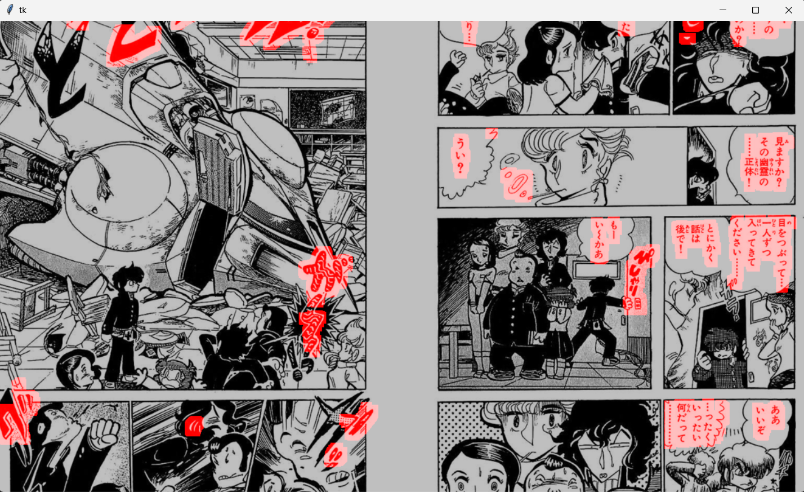
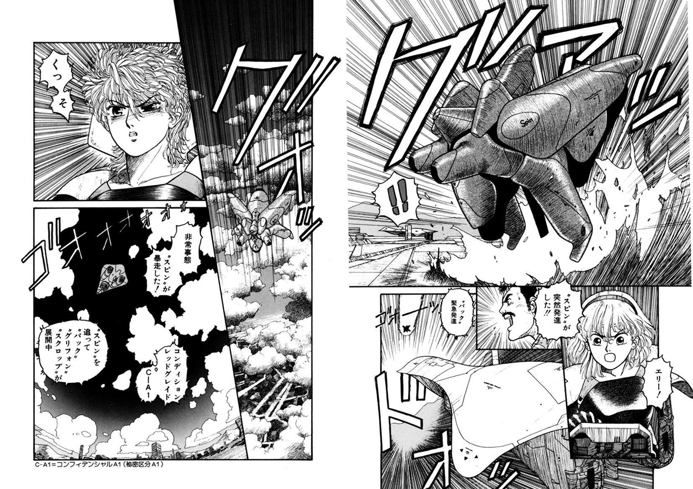
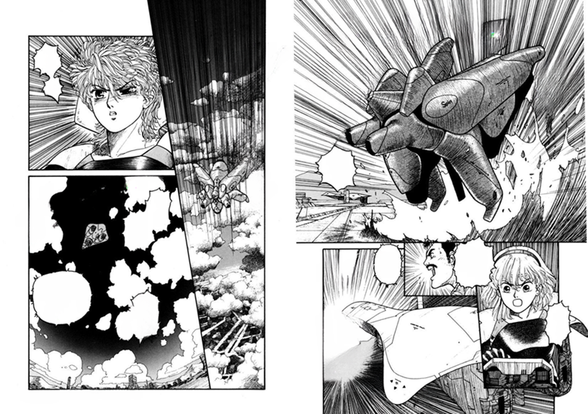

# Navigator
[Deep Image Inpainting research](#deepimageinpainting)

[Manga symbol cleaning](#manga-inpainting-application)
# DeepImageInpainting
A project to solve the Image Inpainting problem using generative deep neural networks. Essentially, we are trying to predict a masked part of the image based on the entire context of the image.
## Examaple
You can try our old models on collab.
1. [Vanilla AE](https://colab.research.google.com/drive/1ApWMUxXFhksdLbjA5b-s3QTS4_3HkgM8?usp=sharing)
2. [Pixel CNN](https://colab.research.google.com/drive/1LzLzK4YSU2tJrdFndGbIIYSAx8qYjUWI?usp=sharing)
3. [Unet](https://colab.research.google.com/drive/1lJDoIicTpp9nR_8kCOgljNYpAiKmqnvP?usp=sharing)
4. [Diagonal BLSTM](https://colab.research.google.com/drive/1JPW-W1iz4bMrzoSki7o9YplzFAHS-0pz?usp=sharing)
## Results on CIFAR10 and STL10
* Vanilla AE <br/>
  

* Pixel CNN <br/>
  

* UNet <br/>
  
* We also tried some open-source models. The most successfull example found so far is [Inpaint-Anything](https://github.com/geekyutao/Inpaint-Anything/tree/main). It combines an inpainting model and Meta's SAM model for segmenting objects <br/>


# Manga Inpainting Application
We used the best model - LAMA for manga inpainting problem.
## Installation
1. Clone repository
```console
git clone --recurse-submodules https://github.com/Nagim123/DeepImageInpainting.git -b InpaintingPipelineLama
```
2. Create and activate virtual environment
```console
cd DeepImageInpainting
```
```console
python -m venv .venv
```
```console
.venv\Scripts\activate
```
3. Install dependencies
```console
pip install -r requirements.txt
```
4. Download models
```console
python src/model_downloader.py
```
## How to use
Run the following command to apply manga cleaning on all images from **example** directory
```console
python src/manga_cleaner.py --manga_dir example/ --line_width 12
```
You can specify line width for Japanese character selector through **--line width** argument. Command results will be saved in *output* diirectory.
## GUI tutorial
After running the command to clean manga pages the manual mask editor will appear.

 GUI control:
* LMB - draw mask
* RMB - remove mask
* Mouse scroll - change brush size
* Enter - next page

Screenshot of mask editor:

## Example of model inference
|original image|model's output|
|----|----|
|||
